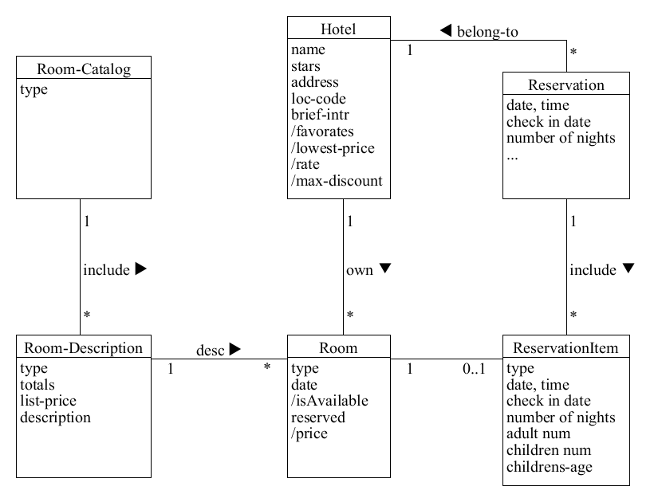
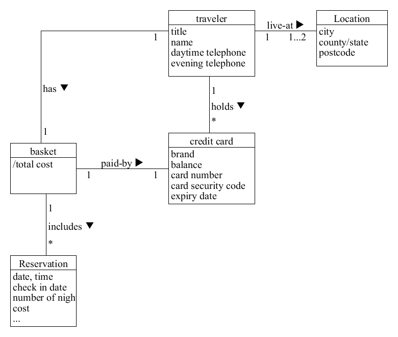

使用 **UMLet** 建模

- 1、使用类图，分别对 Asg_RH 文档中 Make      Reservation 用例以及 Payment 用例开展领域建模。然后，根据上述模型，给出建议的数据表以及主要字段，特别是主键和外键

- - 注意事项：

  - - 对象必须是名词、特别是技术名词、报表、描述类的处理；
    - 关联必须有多重性、部分有名称与导航方向
    - 属性要注意计算字段

  - 数据建模，为了简化描述仅需要给出表清单，例如：

  - - Hotel（ID/Key，Name，LoctionID/Fkey，Address…..）

Make reservation:

Make reservation数据表:

| Hotel            | Name, stars, address, loc-code,   brief-intr, favorites, lowest-price, rate, max-discount |
| ---------------- | ------------------------------------------------------------ |
| Reservation      | Date, time, check in date, number of   nights                |
| ReservationItem  | Type, date time, check in date, number of   nights, adult num, children num, childrens-age |
| Room             | Type, date, isAvailable, reserved, price                     |
| Room-Description | Type, totals, list-price, description                        |
| Room-Catalog     | Type                                                         |

 

Make reservation数据建模:

Hotel (HotelID(key), Name, stars, address, loc-code(foreign key), brief-intr, favorites, lowest-price, rate, max-discount)

Reservation (ReservationID(key), Date, time, check in date, number of nights)

ReservationItem (ItemID(key), Type, date time, check in date, number of nights, adult num, children num, childrens-age)

Room (RoomID(key), Type, date, isAvailable, reserved, price)

Room-Description (RoomID(foreign key), Type, totals, list-price, description)

Room-Catalog (RoomID(foregn key), Type)

 

Payment领域建模:

Payment数据表:

| Basket      | total cost                                                   |
| ----------- | ------------------------------------------------------------ |
| Reservation | cost                                                         |
| Traverler   | title, name, daytime telephone, evening   telephone          |
| Credit card | CardNumber, brand, balance, card security   code, expiry date |
| Location    | city, county/state, postcode                                 |

Payment 数据建模:

Basket (traverlerID(foreign key), total cost)

Reservation (ReservationID(key), cost)

Traverler (traverlerID(key), title, name, daytime telephone, evening telephone)

Credit card (CardNumber(key), brand, balance, card security code, expiry date)

Location (Loc-code(key), city, county/state, postcode)

- 2、使用 UML State Model，对每个订单对象生命周期建模

- - 建模对象：       参考 Asg_RH 文档， 对 Reservation/Order 对象建模。
  - 建模要求：       参考练习不能提供足够信息帮助你对订单对象建模，请参考现在       定旅馆       的旅游网站，尽可能分析围绕订单发生的各种情况，直到订单通过销售事件（柜台销售）结束订单。

