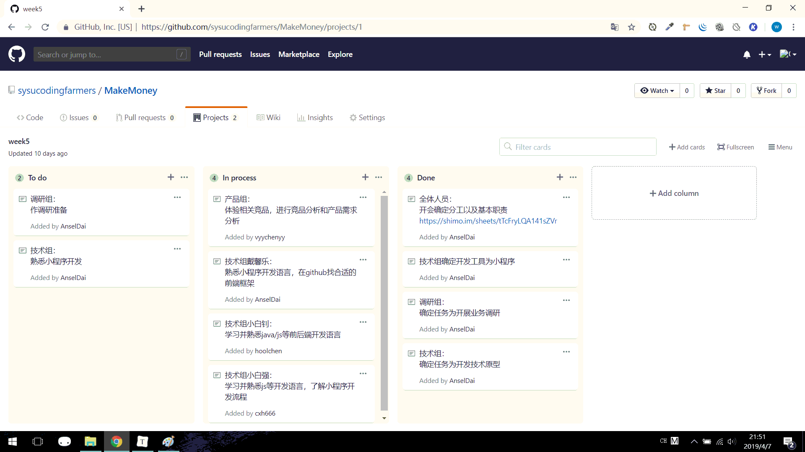
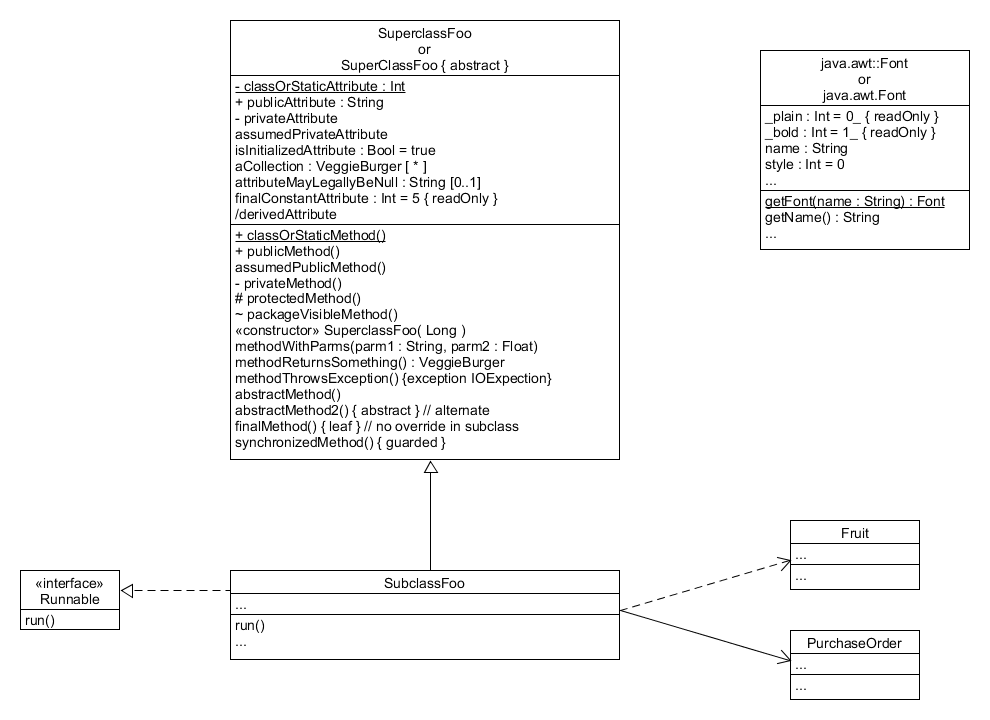

1、简答题

- 用简短的语言给出对分析、设计的理解。

分析注重于分解问题和需求, 而不是求得解决的方案。

设计注重于大致上得到一个满足需求的解决方案, 而不关注如何实现该解决方案。

- 用一句话描述面向对象的分析与设计的优势。

与人的思考方式一致, 具有良好的稳定性、可维护性、复用性。

- 简述 UML（统一建模语言）的作用。考试考哪些图？

UML可以用作草图、蓝图、程序语言或敏捷建模。

- 从软件本质的角度，解释软件范围（需求）控制的可行性

软件本质有复杂性、一致性、可变性、不可视性。

软件需求控制要求在不一致、不可视、易变化的环境下定义需求风险。

2、项目管理实践

- 看板使用练习（提交看板执行结果贴图，建议使用 Git project）
- - 使用截图工具（png格式输出），展现你团队的任务       Kanban
  - 每个人的任务是明确的。必须一周后可以看到具体结果
  - 每个人的任务是1-2项
  - 至少包含一个团队活动任务

 

UML绘图工具练习（提交贴图，必须使用 UMLet）

- 请在 参考书2 或 教材 中选择一个类图（给出参考书页码图号）

中文版P181图16-1

