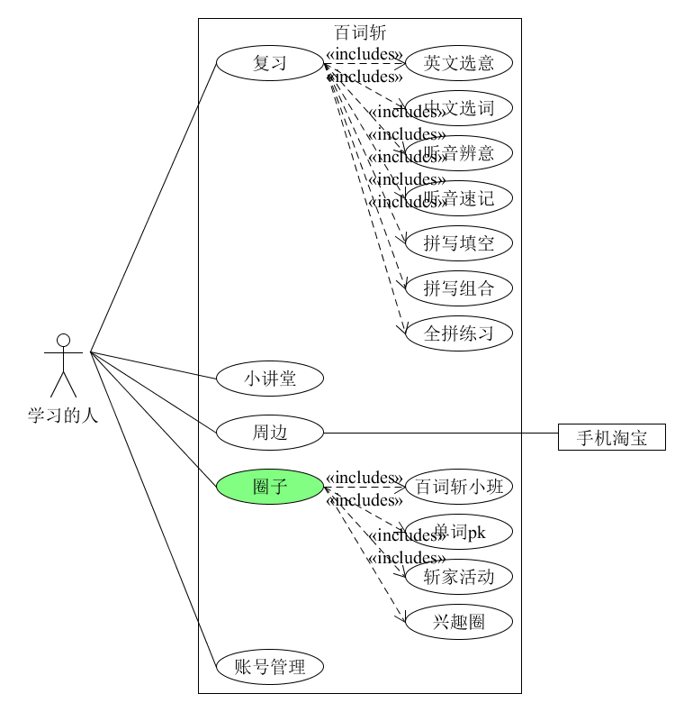
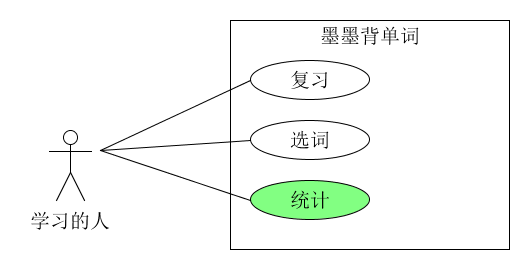

1、简答题

1. 用例的概念

用例是指相关的成功或者失败的描述参与者使用系统来完成目标的场景的集合。

1. 用例和场景的关系？什么是主场景或 happy path？

场景是一系列具体的在参与者和系统之间的动作或会话, 是用例的实例。

主场景是指一种典型的、无条件的、成功的happy path场景。

Happy path是指没有额外情况或者错误情况的场景。

1. 用例有哪些形式？

用例有①概述形式; ②简便形式; ③完全形式。

1. 对于复杂业务，为什么编制完整用例非常难？

因为编制完整用例要求详细写下所有的步骤和变动, 业务一复杂, 用例中的元素就多起来了, 编制完整用例的难度加大。

1. 什么是用例图？

用于描述用例的图。

1. 用例图的基本符号与元素？

参与者actor, 系统system, 外部系统external system。

1. 用例图的画法与步骤

① 确定研讨的系统

② 识别actors

③ 识别系统依赖的外部系统

④ 识别用例

⑤ 识别子功能级别的用例

⑥ 正确使用用例与子用例之间的关系

1. 用例图给利益相关人与开发者的价值有哪些？

① 明确系统的业务范围、服务对象(角色)、外部系统与设备

② 帮助识别技术风险, 提前实施关键技术原型公关与学习

③ 易于评估项目工作量, 合理规划迭代周期, 规划人力需求

2、建模练习题（用例模型）

- 选择2-3个你熟悉的类似业务的在线服务系统（或移动 APP），如定旅馆（携程、去哪儿等）、定电影票、背单词APP等，分别绘制它们用例图。并满足以下要求：

- - 请使用用户的视角，描述用户目标或系统提供的服务
  - 粒度达到子用例级别，并用 include 和 exclude 关联它们
  - 请用色彩标注出你认为创新（区别于竞争对手的）用例或子用例
  - 尽可能识别外部系统和服务

- 然后，回答下列问题：

- 1. - 为什么相似系统的用例图是相似的？
     - 如果是定旅馆业务，请对比 Asg_RH 用例图，简述如何利用不同时代、不同地区产品的用例图，展现、突出创新业务和技术
     - 如何利用用例图定位创新思路（业务创新、或技术创新、或商业模式创新）在系统中的作用
     - 请使用 SCRUM 方法，选择一个用例图，编制某定旅馆开发的需求（backlog）开发计划表
     - 根据任务4，参考 [使用用例点估算软件成本](https://www.ibm.com/developerworks/cn/rational/edge/09/mar09/collaris_dekker/index.html)，给出项目用例点的估算

 